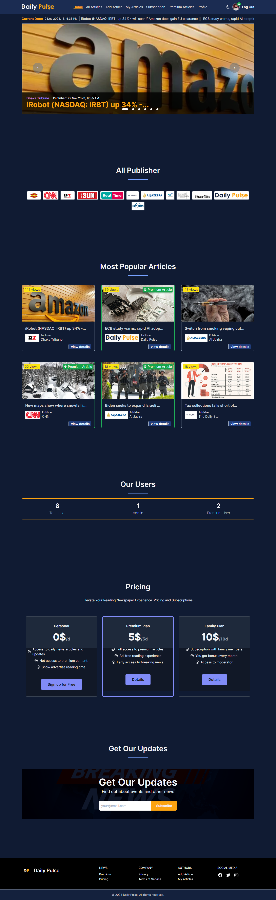

## Daily Pulse

 
 

**Live site link:** https://daily-pulse-client.web.app

 

## Technologies I use

 

## Website Feature:

**Daily Pulse** is a e-newspaper website for any person. Here is explain our some website features.

* All type of users can visit this website, and they can read free news after login.
* In our website has a premium articles page. If user is normal user, and he/she try to go to premium articles page, from authentication system send him to subscription page. 
* Here is used JWT for API and private route secure. When user Login with Email and password, sign in with google create a token for user and save it in his local storage.
* Navbar all pages are mobile and tablet device responsive.
* User can add article, update and edit.
* If user visit his own article, article's views not increase. User can delete his article if article's status is pending but if articles status is approved user can't able to delete his own article. 
* In my website has a beautiful dashboard to manage all articles, user and publisher. If user is Admin, his power is supper power. Admin can delete all users, articles and publishers.

 

## Overview

 

# Thank you for visit my Repository !
